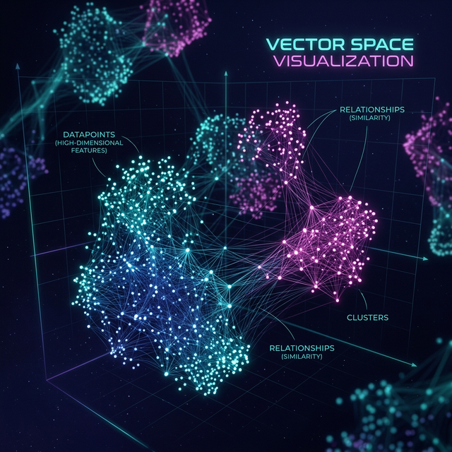
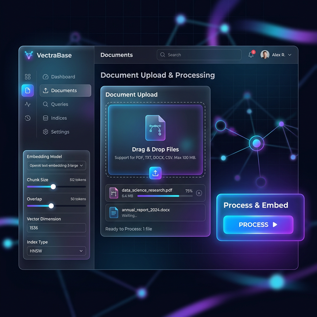
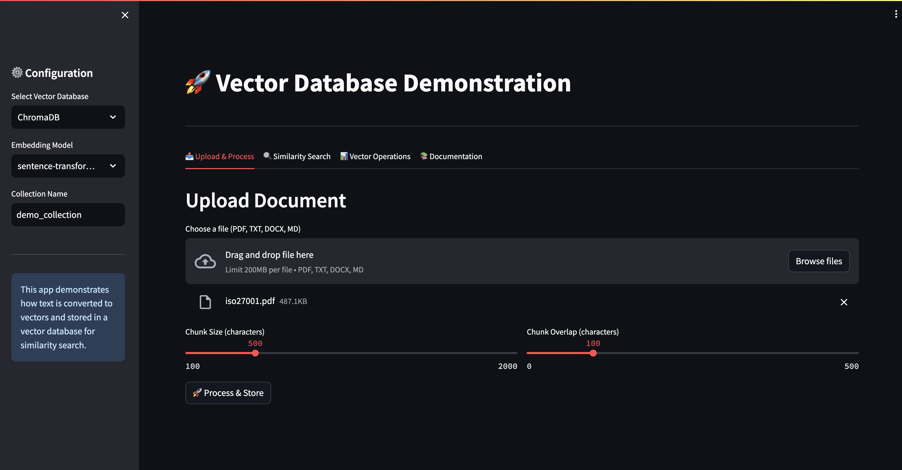
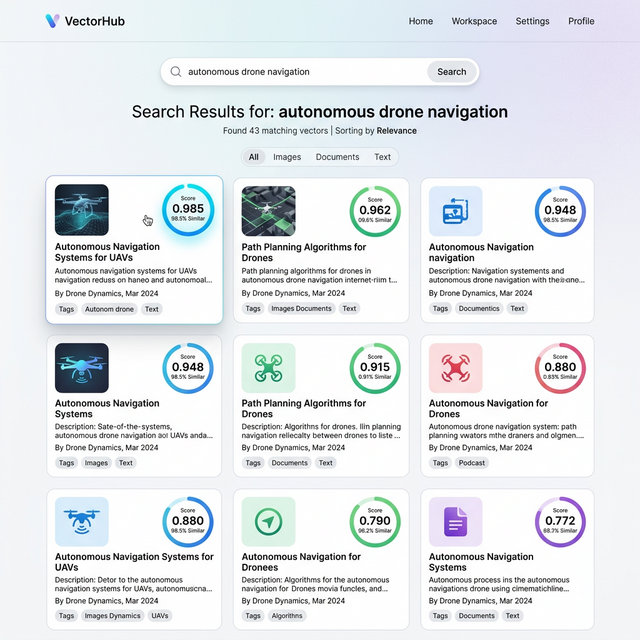
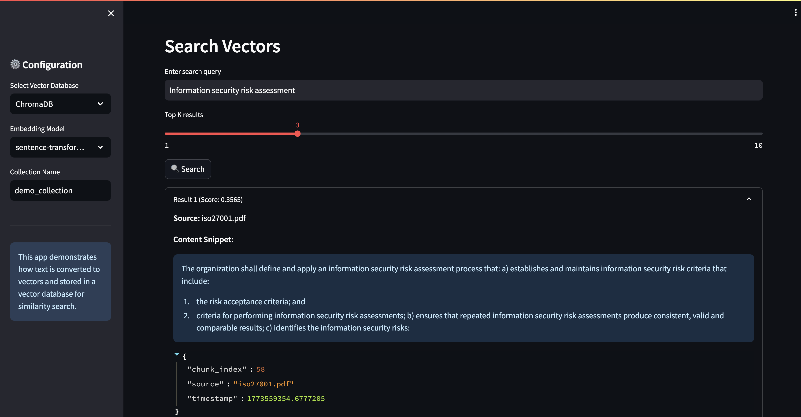
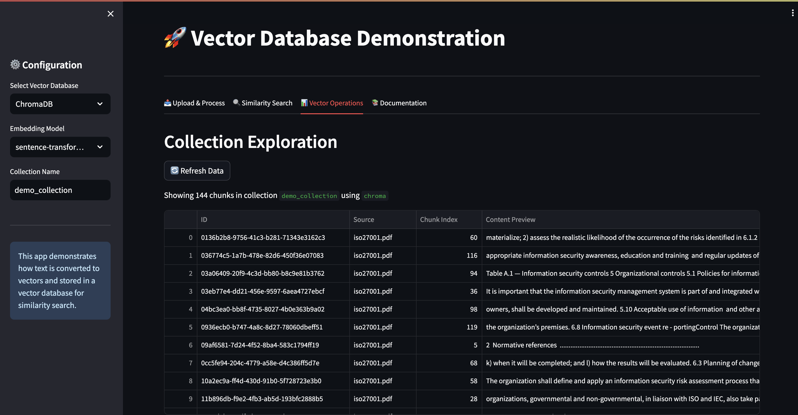

# Vector Database Demonstration Application



A modular, educational application to demonstrate how Vector Databases work using Python, FastAPI, and Streamlit.

## Features
- **Multi-DB Support**: Switch between **ChromaDB** (local) and **Qdrant** (high-performance).
- **Document Processing**: Upload PDF, TXT, DOCX, and Markdown files.
- **Smart Chunking**: configurable chunk size and overlap.
- **Similarity Search**: Interactive semantic search over uploaded data.
- **Vector Inspector**: View stored chunks and metadata.
- **Educational UI**: Built-in guides to explain concepts.

## Project Structure
```
vector-db-demo/
    backend/          # FastAPI server & logic
    vector_db/        # Database integration wrappers
    frontend/         # Streamlit UI
    utils/            # Config & Logging
    docs/             # Educational material
```

## Setup & installation

1. **Clone the repository** (if applicable) or navigate to the project directory.
2. **Install dependencies**:
   ```bash
   pip install -r requirements.txt
   ```
3. **(Optional) Configure OpenAI**:
   If you want to use OpenAI embeddings, create a `.env` file in the root:
   ```
   OPENAI_API_KEY=your_api_key_here
   ```

## Running the Application

You need to run the backend and the frontend separately.

1. **Start the Backend**:
   ```bash
   python -m backend.main
   ```
   The API will be available at `http://localhost:8000`.

2. **Start the Frontend**:
   ```bash
   streamlit run frontend/streamlit_app.py
   ```
   The UI will be available at `http://localhost:8501`.

## How to Use

### 1. Upload & Process



1. **Select Database**: Choose ChromaDB or Qdrant from the sidebar.
2. **Upload**: Drop a PDF or TXT file and click "Process & Store".

### 2. Similarity Search




3. **Search**: Go to the "Similarity Search" tab and ask questions about the document.
4. **Inspect**: Explore "Vector Operations" to see how data is structured.

## Docker Usage

You can run the entire stack (including a dedicated Qdrant instance) using Docker Compose:

1. **Build and Start**:
   ```bash
   docker-compose up --build
   ```
2. **Access the Apps**:
   - Frontend: `http://localhost:8501`
   - Backend API: `http://localhost:8000`
   - Qdrant Dashboard: `http://localhost:6333/dashboard`

3. **Stop**:
   ```bash
   docker-compose down
   ```
